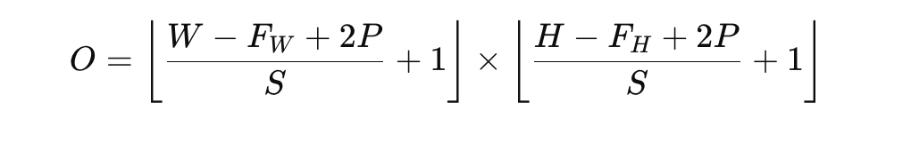

# HW to Chapter 13 “Convolutional Layer”

## Non-programming Assignment

### Q1. What is convolution operation and how does it work?
Answer:  

The convolution operation is a mathematical process commonly used in image processing and deep learning, particularly in Convolutional Neural Networks (CNNs). It serves to apply a filter (also known as a kernel) to an input image or signal to extract certain features, such as edges, textures, or patterns. This operation is central to the functioning of CNNs, where it enables the network to automatically and adaptively learn spatial hierarchies of features.

#### How Convolution Works:  

Filter/Kernel: A filter is a small matrix of weights. In the context of image processing, this filter is slid (convolved) across the input image.

Sliding: The filter is applied over the image one pixel at a time. At each position, it covers a small area of the image, equal in size to the filter.

Element-wise Multiplication and Sum: For each position of the filter over the image, an element-wise multiplication is performed between the values of the filter and the corresponding pixels of the image it covers. The results of these multiplications are then summed up to produce a single output value.

Feature Map: The process is repeated across the entire image, sliding the filter over all possible positions. Each output value is used to construct a new image, called a feature map, which highlights the presence of specific features detected by the filter in the original image.

#### Example:  

Consider an image represented as a matrix of pixel values and a 3x3 filter. To apply the convolution operation:  

Place the filter on top of the image starting at the top-left corner.
Multiply each element of the filter with the corresponding element of the image it covers, sum all these products, and write the sum to the output feature map.
Slide the filter to the next position on the right (and eventually down the rows), repeating the multiplication and summing process.
Continue until the entire image has been covered.

#### Purpose of Convolution:  

Feature Detection: Different filters can detect different features, such as edges, corners, or textured patterns, by emphasizing pixels where the feature is present.
Dimensionality Reduction: Through the process of applying filters, convolution can also reduce the dimensionality of the input, focusing on the most relevant information.
Learnable Filters: In CNNs, the weights of the filters are learned automatically during training, allowing the network to identify which features are most important for a given task, such as image classification or object detection.
The convolution operation, through its simplicity and efficiency, allows neural networks to build complex and hierarchical representations of images, making it a cornerstone of modern image recognition and computer vision applications.

### Q2. Why do we need convolutional layers in neural networks?
Answer:   

Convolutional layers are a cornerstone in the architecture of Convolutional Neural Networks (CNNs), a class of deep neural networks highly effective in tasks related to image processing, computer vision, and beyond. Their introduction and widespread use have several motivations and benefits:

1. Feature Extraction:
Hierarchical Learning: Convolutional layers automatically and adaptively learn spatial hierarchies of features from input images. They start from small, simple patterns in early layers (edges, colors, gradients) and progressively learn more complex features in deeper layers (textures, parts of objects, etc.).
Robustness to Variations: They are designed to recognize patterns regardless of their position in the input. This translation invariance makes CNNs robust to the location of features within the image.  

2. Parameter Efficiency:
Shared Weights: In a convolutional layer, the same filter (weights) is applied across the entire input, significantly reducing the number of parameters compared to a fully connected layer of similar size. This shared-weight architecture mimics the response of a neuron in the visual cortex to stimuli located in different regions of the visual field.
Reduced Overfitting: With fewer parameters, convolutional layers are less prone to overfitting, especially when dealing with high-dimensional input data such as images.  

3. Local Connectivity:
Focusing on Local Patterns: Convolutional layers connect neurons to only a local region of the input, making the assumption that the local spatial correlation in images is more relevant for feature detection. This locality principle allows CNNs to concentrate on the small, meaningful patterns before integrating them into larger, complex patterns in higher layers.  

4. Scalability and Versatility:
Scalable to Large Images: Due to their parameter efficiency and local connectivity, convolutional layers can scale more easily to large images or input fields without an exponential increase in computational requirements.  
Adaptability: CNNs have been successfully applied not just in image recognition, but also in areas like video analysis, natural language processing, and more, demonstrating the versatility of convolutional layers.  

5. Pooling Layers:
Often coupled with convolutional layers, pooling layers (e.g., max pooling) reduce the spatial size of the representation, decrease the amount of parameters and computation in the network, and help achieve spatial invariance to input modifications. This further contributes to the network's ability to handle variations within the input data.  

Conclusion:  
Convolutional layers allow neural networks to efficiently process spatial data, extract critical features, and build up a hierarchical representation of the input, making them essential for tasks requiring the analysis of visual inputs. The effectiveness of CNNs in a wide range of applications underscores the importance of convolutional layers in contemporary AI and machine learning solutions.

### Q3. How are sizes of the original image, the filter, and the resultant convoluted image are relted?
Answer:  

The sizes of the original image, the filter (also known as the kernel), and the resultant convoluted image are related through a straightforward mathematical relationship, which is influenced by three main factors: the size of the input image, the size of the filter, and the convolution operation parameters including padding and stride. Here's how they relate:

1. Input Image Size:
Denoted by W×H for width W and height H.  

2. Filter Size:
Denoted by 
FW × FH
​for filter width FW and filter height FH.  

3. Padding (P):
Padding is the number of pixels added to each side of the input image. It allows the filter to be applied to border elements of the image and controls the spatial size of the output image. Commonly, padding is applied symmetrically, adding the same amount on all sides.  

4. Stride (S):
The stride is the step size by which the filter is moved across and down the input image. A stride of 1 moves the filter one pixel at a time, while a stride of 2 moves it two pixels, and so on.  

Output Image Size Calculation:
Given these parameters, the size of the output image (also called the feature map) can be calculated for each dimension (width and height) using the formula:

where:
O is the size of the output image (width or height, depending on which dimension you're calculating for).
⌊.⌋ denotes the floor function, which rounds down to the nearest whole number.  

This formula ensures that the spatial dimensions of the convolutional output can be determined based on the input image size, filter size, padding, and stride. Adjusting these parameters allows control over the output size, which is crucial for designing neural networks that match specific architectural and performance criteria.

Examples:   
No Padding (P=0) and Unit Stride (S=1): The output size will be smaller than the input size by the size of the filter minus one. This is the most straightforward case, often resulting in a reduction of the output dimensions.
Same Padding: Padding is chosen such that the output size is the same as the input size. This typically requires setting P to (FW − 1)/2 for the width dimension, assuming S=1.
Stride Greater than 1 (S>1): Increases the reduction factor of the output size, effectively down-sampling the input image.
Understanding these relationships is crucial for designing CNN architectures, as it affects how deep a network can go, the field of view of the filters at different layers, and the overall capacity of the network to capture and utilize spatial hierarchies of features.

### Q4. What is padding and why is it needed?
Answer:  

Padding is a technique used in the context of convolutional neural networks (CNNs) and image processing, where extra pixels are added to the border of an input image before applying a convolution operation. The most common type of padding is zero-padding, where pixels with a value of zero are added around the image, although other types of padding can also be used. The purpose of padding includes several key aspects:

1. Dimensionality Control:
Without padding, each convolution operation reduces the size of the output feature map compared to the input. For deep networks with many convolutional layers, this can quickly reduce the spatial dimensions of the feature maps to a point where further convolution operations are not possible. Padding allows the control of output dimensions, enabling the design of deeper networks.  

2. Edge Information Preservation:
In the absence of padding, pixels on the edges and corners of the image are used less frequently in the convolution operations than pixels in the center. This can lead to less learning from the edges, which are often critical for understanding the overall context of an image. Padding ensures that edge pixels have a similar opportunity to be part of the convolution operation, preserving edge information.  

3. Same Padding:
A specific type of padding, known as "same" padding, is designed to ensure that the output feature map has the same spatial dimensions as the input image (when the stride is 1). This is particularly useful for designing networks where the dimensionality of the output is important to maintain throughout the layers.  

4. Avoiding Shrinking Feature Maps:
For certain applications, it's crucial to maintain the spatial dimensions of the feature maps to allow for accurate spatial mappings back to the original image space. This is particularly important in tasks like object detection and segmentation, where the exact location of objects within the input space is critical.  

5. Improving Performance:
By allowing convolutional layers to focus on regions at the border of the image, padding can help in improving the performance of the network by providing a more comprehensive understanding of the input space.
Types of Padding:
Zero Padding: The most common form, where zeros are added around the border.
Reflect Padding: Border pixels are mirrored around the edge.
Replicate Padding: The border pixels are replicated next to the edge.
The choice of padding type and the amount of padding can be adjusted based on the specific requirements of the application and the network architecture. Padding is a simple yet powerful tool in the design of CNNs, enabling more flexible and effective model designs.

### Q5. What is strided convolution and why is it needed?
Answer:   

Strided convolution is a variant of the standard convolution operation used in convolutional neural networks (CNNs), where the filter (or kernel) is applied across the input image or feature map with a certain step size known as the stride. Unlike the standard convolution where the stride is typically 1 (the filter moves one pixel at a time), in strided convolution, the stride can be greater than 1, meaning the filter skips over pixels as it moves across the image.

#### How Strided Convolution Works:
With a stride of S, the filter jumps S pixels at a time when it slides over the image. For example:

A stride of 2 moves the filter two pixels at a time.
This results in fewer positions where the filter is applied, reducing the spatial dimensions of the output feature map compared to a stride of 1.  

#### Why Strided Convolution is Needed  

Dimensionality Reduction:

Strided convolution is an effective way to reduce the size of the feature maps, decreasing the computational load for subsequent layers and reducing the amount of memory required to store the feature maps. This is particularly useful in deep networks, where computational efficiency is crucial.  

Pooling Alternative:

It can serve as an alternative to pooling layers (e.g., max pooling), achieving similar effects of down-sampling and dimensionality reduction without the need for additional layers. This simplifies the architecture while still providing the benefits of spatial invariance and reduced sensitivity to small translations in the input.  

Increasing the Field of View:

By effectively skipping over parts of the input, strided convolutions increase the field of view of the filter. This means each element in the output feature map corresponds to a larger region in the input image, helping the network to capture more global features as it goes deeper.  

Efficiency and Speed:

In many applications, especially those involving very large images or real-time processing, the speed and efficiency gains from using strided convolutions are significant. Reducing the spatial dimensions early in the network allows for quicker processing through the rest of the network.  

Feature Extraction at Multiple Scales:

Strided convolutions can help in extracting features at multiple scales or resolutions. By adjusting the stride, a network can be designed to focus on both local details (with smaller strides) and more global patterns (with larger strides), which is beneficial for tasks like object detection where objects of interest can vary significantly in size.  

#### Conclusion:
Strided convolution offers a versatile tool within CNNs for controlling the size of feature maps, improving computational efficiency, and adjusting the network's focus on different scales of features. By carefully choosing the stride, along with other parameters like filter size and padding, it's possible to design highly effective neural networks tailored to a wide range of tasks in image processing, computer vision, and beyond.